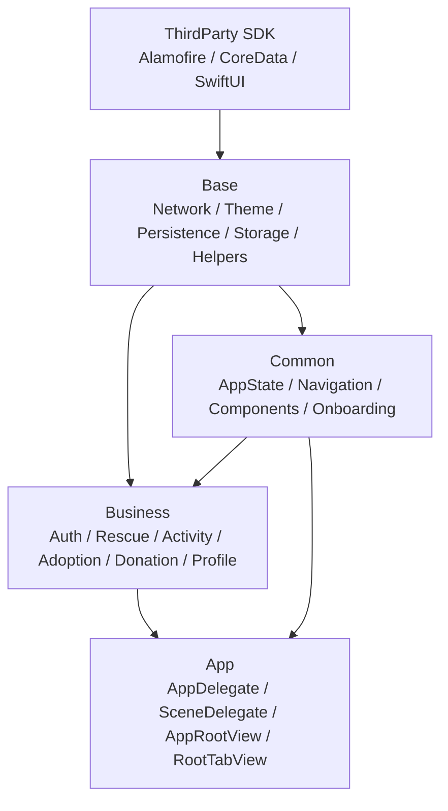

# Rabbit_iOS 系统架构

`Rabbit_iOS` 按业务模块、公共能力、基础库三层重新整理。`App` 只负责应用生命周期和根装配，`Resources` 与 `Info.plist` 保持原路径，避免影响 bundle 资源加载和 Xcode build setting。

## 架构图



## 目录树

```text
Rabbit_iOS/
  App/
    AppDelegate.swift
    SceneDelegate.swift
    AppRootView.swift
    RootTabView.swift
    ViewController.swift
  Business/
    Auth/
      LoginView.swift
      LocalAuthCatalog.swift
    Rescue/
      RescueTabView.swift
      RescueDetailView.swift
      CreateRescuePostView.swift
      RescueFiltersView.swift
      LocationPickerSheet.swift
      ViewModels/
      Components/
      Models/
      Support/
    Activity/
    Adoption/
      Support/
    Donation/
    Profile/
  Common/
    AppState/
      AppDataStore.swift
    Navigation/
      MainTab.swift
      MainTabCoordinator.swift
      TabOrderSettings.swift
    Components/
      PostImageView.swift
      RabbitLoadingView.swift
      WechatQRImageView.swift
      ZoomableUIImageView.swift
    Onboarding/
      WelcomeGuideView.swift
      WelcomeGuideOverlay.swift
      WelcomeGuideMedia.swift
      WelcomeGuideVideoView.swift
  Base/
    Network/
      RabbitAPIService.swift
      APIAuthHeaders.swift
      APIQueryModels.swift
      APIProfileModels.swift
      APIAdoptionActivityModels.swift
    Theme/
      Theme.swift
      LayoutMetrics.swift
      DualColumnFeedLayout.swift
    Persistence/
      PersistenceController.swift
      RabbitModel.xcdatamodeld
    Storage/
      AdminNotificationsStore.swift
      RabbitCommunityStore.swift
      RescueDraftStore.swift
      UserInboxStore.swift
    Helpers/
      AgeCalculator.swift
      ChineseContentValidator.swift
      L10n.swift
  Resources/
    Adoption/
    RescueFeed/
    WelcomeGuide/
  Assets.xcassets/
  Base.lproj/
  Info.plist
```

## 分层职责

- `Business`：具体业务页面、业务 ViewModel、业务模型与模块内支撑能力，例如救援、活动、领养、捐换、个人页。
- `Common`：多个业务模块共享的应用能力，例如全局 `AppDataStore`、Tab 导航、通用图片/二维码组件、新手引导。
- `Base`：不依赖具体业务的基础能力，例如网络服务、主题布局、Core Data、UserDefaults 存储封装、通用工具函数。
- `App`：应用入口、登录门控和根 Tab 装配，不承载具体业务逻辑。
