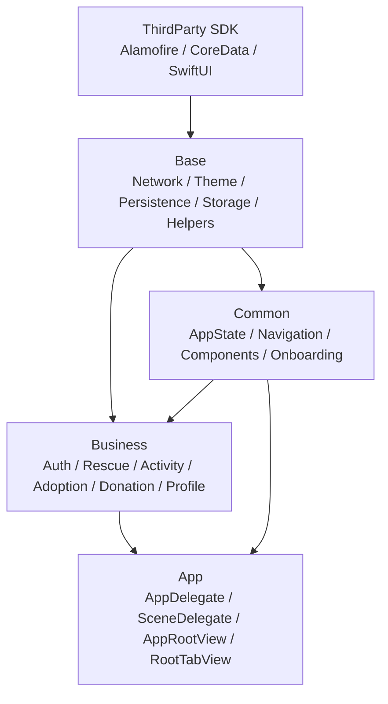
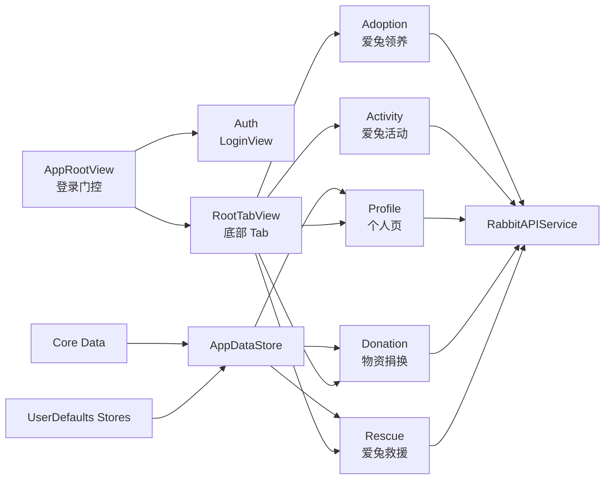

# Rabbit_iOS

`Rabbit_iOS` 是爱兔会业务的 iOS 客户端，面向救援、活动、领养、物资捐换和个人中心等核心流程。项目使用 SwiftUI 承载主要界面，UIKit 负责应用生命周期和 Scene 装配，网络层通过 Alamofire 访问后端接口，并在接口不可用时保留本地种子与缓存回退能力。

## 技术栈

- Swift 5
- SwiftUI + UIKit Scene Lifecycle
- iOS 17.6+
- Core Data
- CocoaPods
- Alamofire `~> 5.11`
- Xcode 文件系统同步组（`PBXFileSystemSynchronizedRootGroup`）


## 核心功能

- 登录门控：`AppRootView` 根据 `AppDataStore.isLoggedIn` 在登录页和主界面之间切换。
- 本地演示账号：`LocalAuthCatalog` 内置管理员账号 `1` 和普通用户账号 `2`。
- 底部导航：`MainTab` 和 `MainTabCoordinator` 管理救援、活动、领养、捐换、个人页 5 个 Tab。
- 救援业务：支持救援列表、筛选、详情、发布、审核状态展示和本地种子数据回退。
- 捐换业务：支持物资捐换列表与发布，并可通过后端接口创建记录。
- 个人中心：支持个人资料、钱包、站内信、管理通知和“我的发布”等入口。
- 新手引导：`WelcomeGuideView` 使用本地媒体资源展示欢迎内容，并通过悬浮按钮唤起。
- 网络回退：`RabbitAPIService` 在未配置有效 API 地址或请求失败时使用本地 mock / bundle 数据。

## 安装与配置

### 前置要求

- macOS + Xcode
- iOS 17.6+ Simulator 或真机
- CocoaPods

### 安装依赖

```bash
cd Rabbit_iOS
pod install
```

## 使用说明

启动 App 后进入登录页，可使用本地演示账号：

- `1`：管理员，具备救援审核、社区删帖、线下活动新增、橱窗收款、管理通知等能力。
- `2`：普通用户，具备浏览、发布救援、捐换、领养及社区互动等能力。

登录后进入底部 Tab 主界面：

- `爱兔救援`：查看救援列表、筛选救援、查看详情、发布救援帖。
- `爱兔活动`：查看打卡、云养、线下活动与橱窗相关内容。
- `爱兔领养`：查看领养流程和领养相关内容。
- `物资捐换`：查看和发布物资捐换信息。
- `个人页`：查看个人资料、钱包、消息、管理通知和我的发布。

## 目录结构

```text
Rabbit_iOS/
  README.md
  ARCHITECTURE.md
  Podfile
  Podfile.lock
  Rabbit_iOS.xcworkspace
  Rabbit_iOS.xcodeproj
  Rabbit_iOS/
    App/
      AppDelegate.swift
      SceneDelegate.swift
      AppRootView.swift
      RootTabView.swift
      ViewController.swift
    Business/
      Auth/
      Rescue/
        ViewModels/
        Components/
        Models/
        Support/
      Activity/
      Adoption/
        Support/
      Donation/
      Profile/
    Common/
      AppState/
      Navigation/
      Components/
      Onboarding/
    Base/
      Network/
      Persistence/
      Storage/
      Theme/
      Helpers/
    Resources/
      Adoption/
      RescueFeed/
      WelcomeGuide/
    Assets.xcassets/
    Base.lproj/
    Info.plist
    rabbit_seed.json
```

## 系统架构

项目按业务模块、公共能力、基础库三层整理。`App` 只负责生命周期和根装配，`Business` 承载具体业务页面与模块内逻辑，`Common` 提供跨业务复用能力，`Base` 提供网络、持久化、存储、主题和工具能力。



## 模块图



## 相关文档

- [`ARCHITECTURE.md`](ARCHITECTURE.md)：系统分层、目录树和架构图。

## License

当前目录未发现明确的 License 文件。如需开源或对外分发，请补充许可证声明。
